# 🛍️ Remnawave ShopBot Extended

> Форк [CyberERROR/remnawave-shopbot](https://github.com/CyberERROR/remnawave-shopbot) — Telegram Mini App для клиентов, вложения в поддержке, единая тёмная тема.

<div align="center">

[](LICENSE)
[](https://github.com/KirillkaUsov/cybererror-s-remnawave-shopbot-extended/commits)
[](https://github.com/KirillkaUsov/cybererror-s-remnawave-shopbot-extended/issues)
[](https://www.python.org/downloads/)

</div>

---

## Для кого это

Для тех, кто **уже держит** оригинальный Remnawave ShopBot и хочет большего. Как устроен сам бот, как подключить платёжки, настроить хосты, тарифы и рефералку — всё это описано в [README оригинала](https://github.com/CyberERROR/remnawave-shopbot#readme) и здесь не дублируется. Ниже только то, чем этот форк от него отличается.

Если вы никогда не запускали оригинальный бот — начните с него, а сюда возвращайтесь, когда захотите мини-апп и остальное.

---

## Что добавлено

### 🪟 Telegram Mini App для клиентов

Полноценный кабинет вместо переписки с ботом: подписки с оставшимся сроком и списком устройств, покупка и продление, пополнение баланса, промокоды, инструкции по подключению, обращения в поддержку с перепиской. Работает и как мини-апп внутри Telegram, и как обычный сайт в браузере.

Вход: `initData` внутри Telegram, а в браузере — Telegram, Email или ссылка подписки. Токен кабинета живёт в `localStorage` и куке.

| Подписки | Тарифы | Кабинет |
|:---:|:---:|:---:|
| 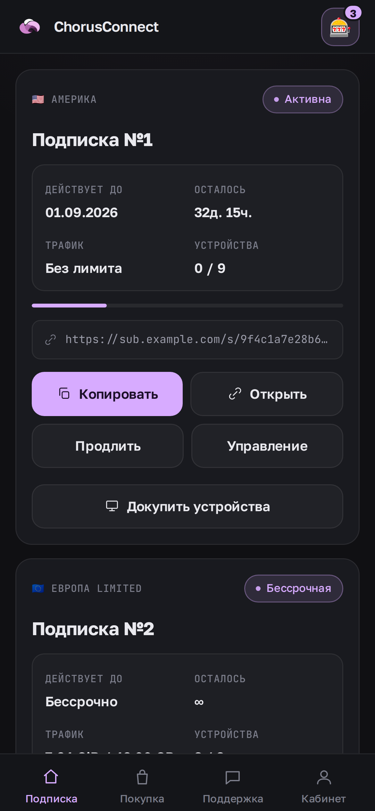 | 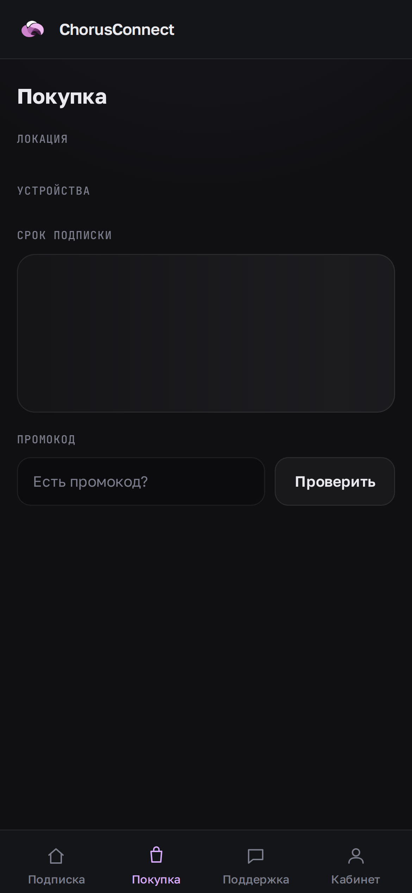 | 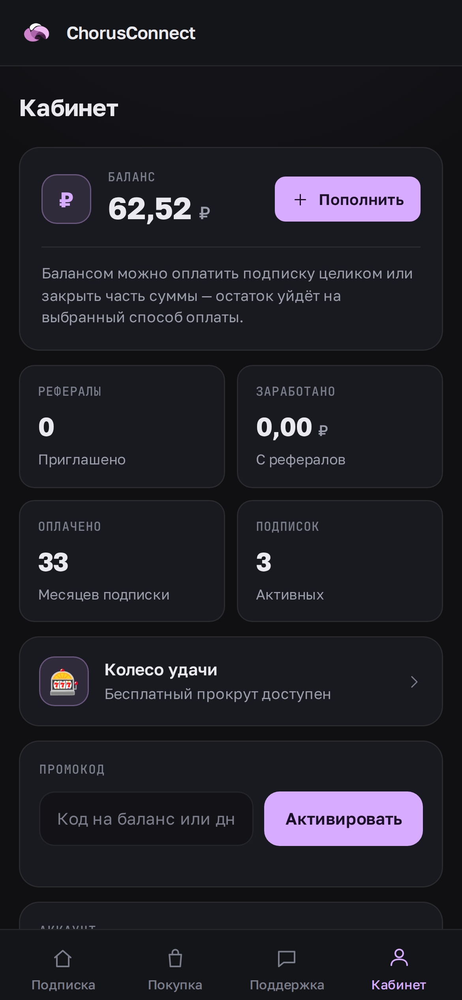 |
| 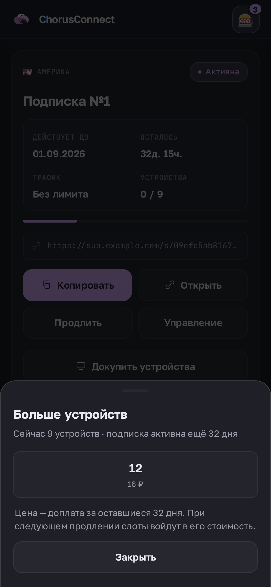 | 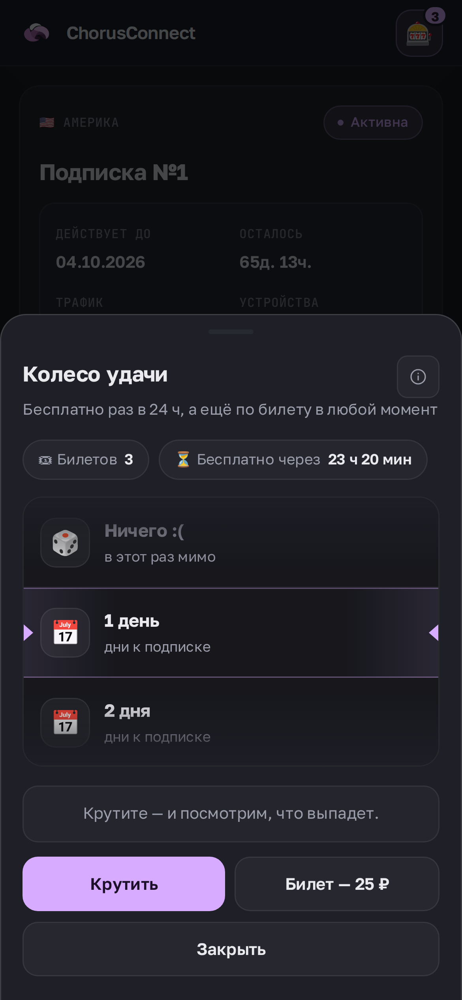 | 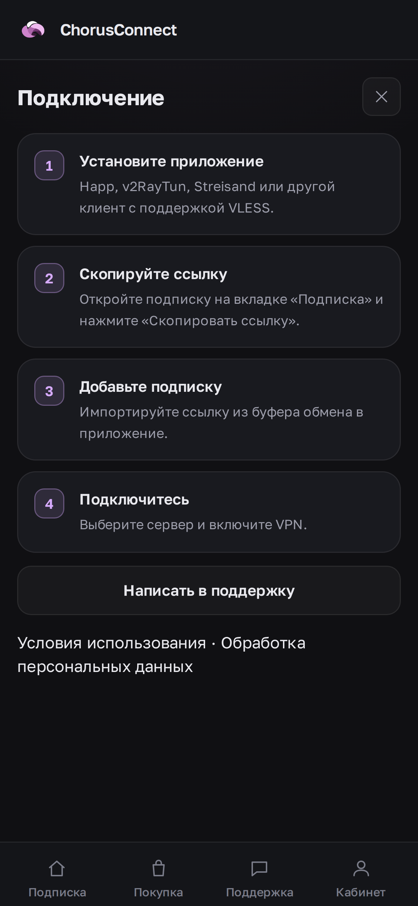 |
| Докупка устройств | Колесо удачи | Инструкция |
| 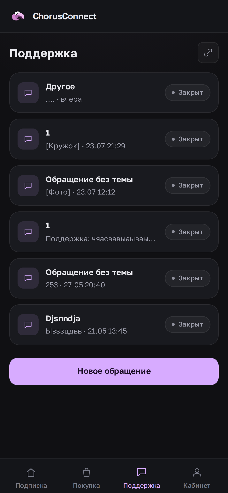 | | |
| Поддержка | | |

### 📱 Устройства докупаются отдельно от продления

Раньше поднять лимит одновременных подключений можно было только вместе с продлением — то есть заплатив за срок, который ещё не кончился. Теперь на локациях с наборами устройств (`device_mode = tiers`) в боте и мини-аппе есть отдельная покупка: срок не меняется, доплата считается по остатку — разница в месячной цене набора, умноженная на оставшиеся дни.

Цену считает только сервер: клиент присылает лишь желаемое количество устройств, а набор и сумма пересчитываются заново перед созданием счёта. Истёкшим, бессрочным и уже максимальным подпискам докупка не предлагается — вместо кнопки они получают объяснение.

### 🎰 Колесо удачи с билетами

Бесплатный прокрут раз в сутки — и билеты, чтобы крутить, не дожидаясь суток. Билет даётся за покупку подписки, за друга, пришедшего по ссылке, покупается за баланс или выдаётся админом вручную; все ставки задаются в панели, а каждое движение билетов пишется в журнал, чтобы остаток можно было объяснить.

Сектор даёт дни к подписке, рубли на баланс, персональный купон на скидку или ничего. Купон создаётся одноразовым, с датой сгорания и подписью, кому и за какой сектор он выдан.

Дни не падают куда попало и не пропадают, если подписки ещё нет: приз ложится в историю кабинета и ждёт там владельца. Забрать его можно в течение 14 дней (срок настраивается), выбрав подписку, к которой он добавится. В истории показываются только выигрыши — пустые сектора туда не попадают, — и первыми идут те, что ещё ждут действия.

В мини-аппе призы проматываются вертикальной лентой и тормозят на выпавшем — на телефоне такая карточка читается лучше круга, где подпись приходится втискивать в сектор шириной в палец. Что мелькает по дороге, выбирается по тем же весам, но результат приходит с сервера.

Розыгрыш идёт целиком на сервере: клиент отправляет «крути» и получает результат, так что выигрыш нельзя подделать запросом. Попытка занимается одним условным `UPDATE` — двойной тап не прокрутит колесо дважды. Шансы видно и в боте, и в мини-аппе: колесо, которое их прячет, доверия не стоит.

Вход — в верхней панели мини-аппа и в главном меню бота, со счётчиком билетов. Когда бесплатный прокрут снова созревает, планировщик напоминает об этом тем, кто уже играл: не чаще раза за кулдаун, с отключением и глобально в панели, и лично в самом колесе.

### 🔗 Привязка Telegram к веб-аккаунту

Аккаунт, созданный по Email, привязывается к Telegram-профилю через `initData` — дальше это один и тот же пользователь с одним балансом и одними подписками.

### 📎 Вложения в поддержке

Фото, видео, голосовые и документы из обращений сохраняются локально рядом с тикетом, а не живут одним `file_id` в Telegram. В панели — отдельный раздел с превью, размерами, поиском осиротевших файлов и чисткой по возрасту.

### 🎨 Одна тёмная тема на всё

Панель, мини-апп и лендинг в одной палитре с сиреневым акцентом. Зелёного не осталось нигде: переопределены даже Tailwind-шкалы `green/emerald/teal/lime`, чтобы случайно забытый класс не дал неоновой зелени.

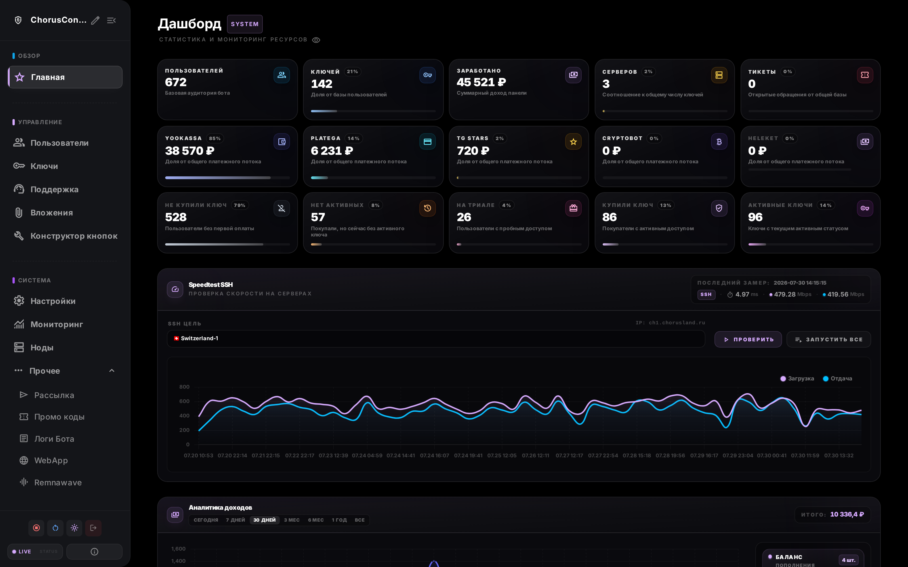

<details>
<summary><b>Ещё разделы панели</b></summary>

<br>

| | |
|:---:|:---:|
| 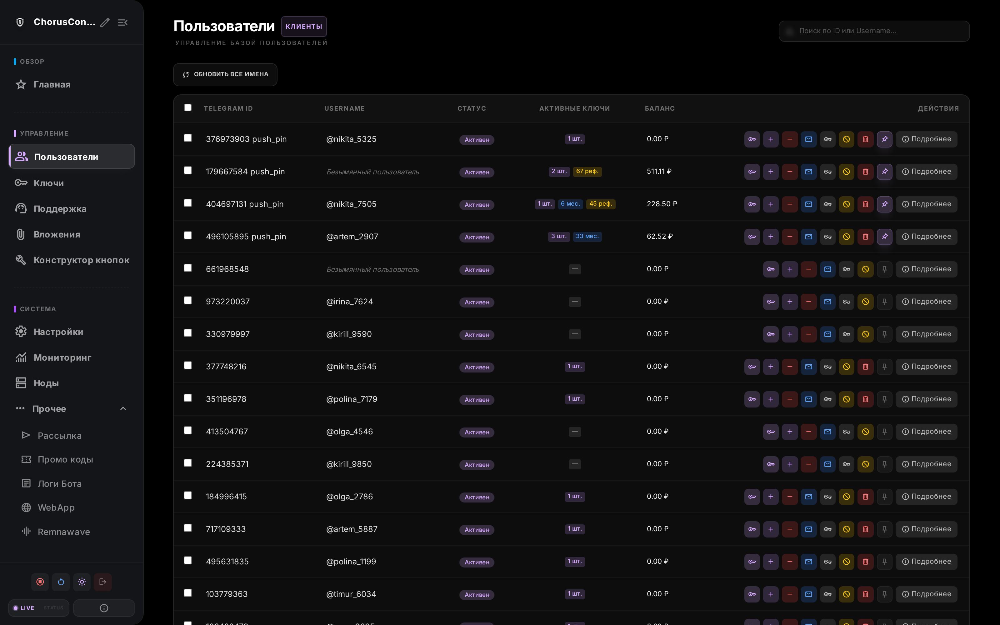 | 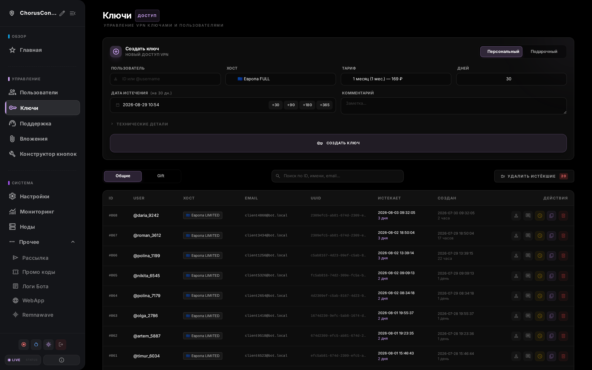 |
| Пользователи | Ключи |
| 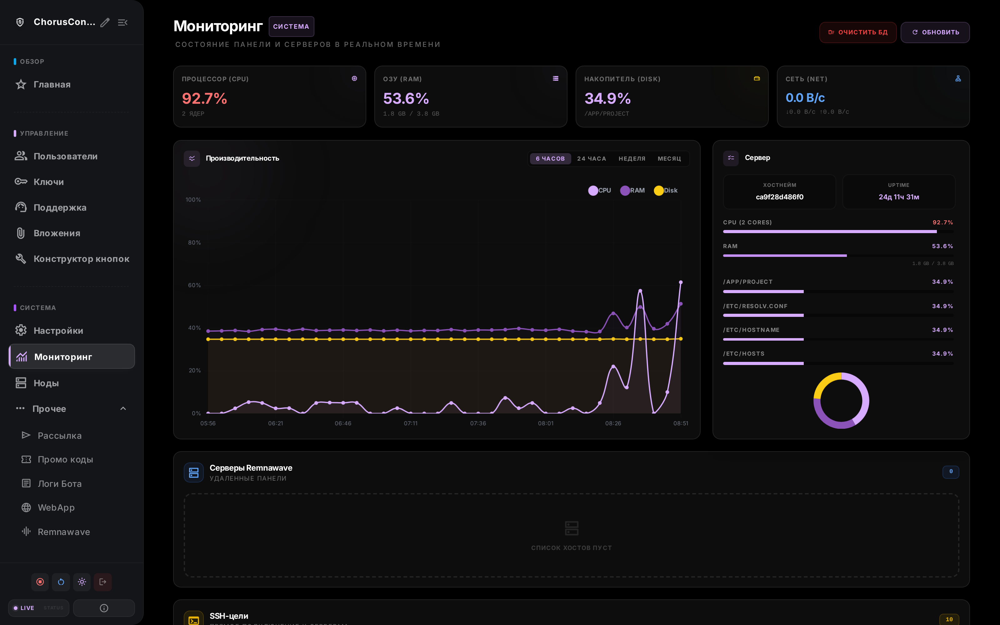 | 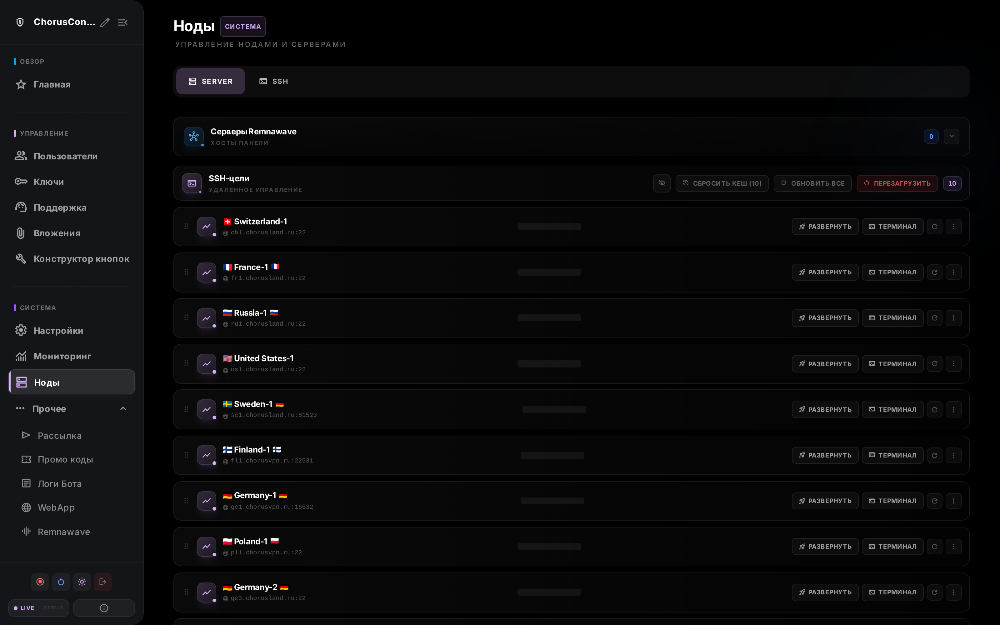 |
| Мониторинг | Ноды |
| 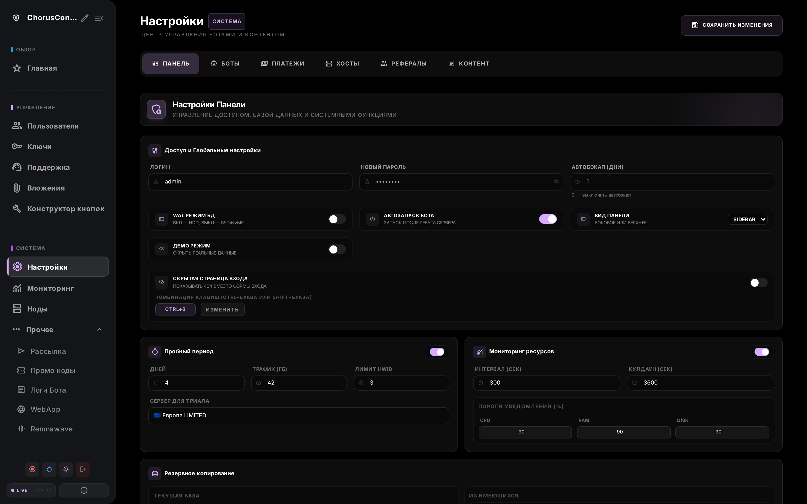 | 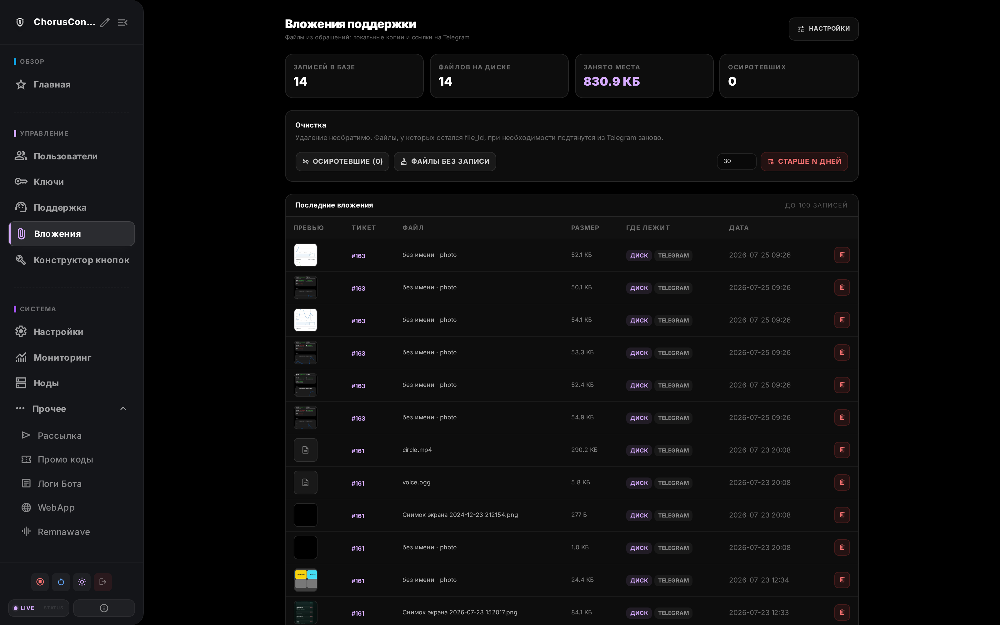 |
| Настройки | Вложения поддержки |
| 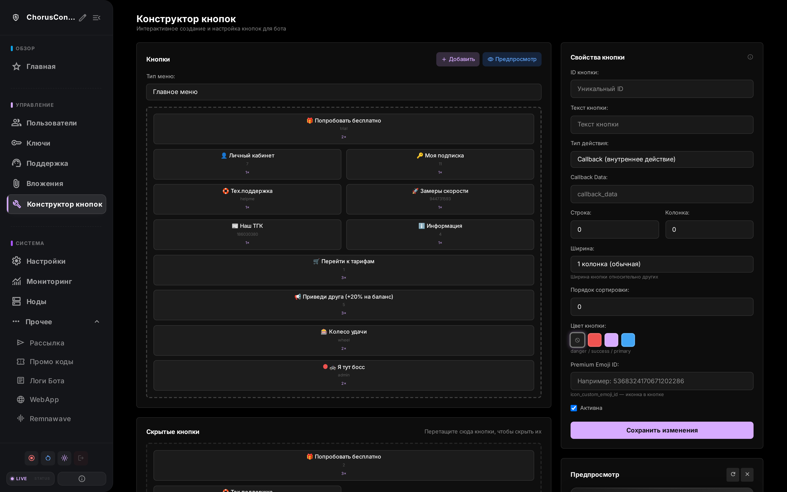 | 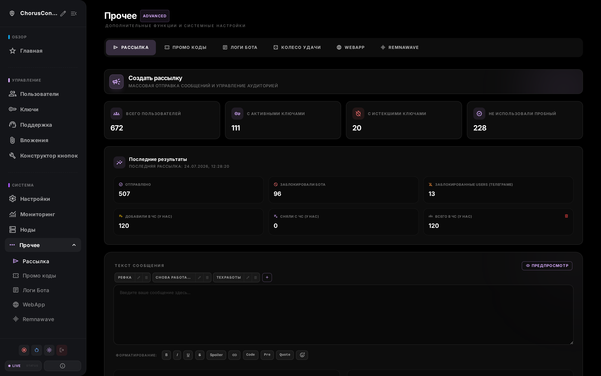 |
| Конструктор кнопок | Рассылка |
| 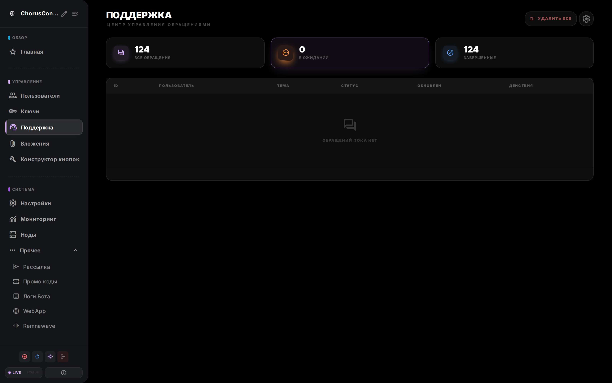 | 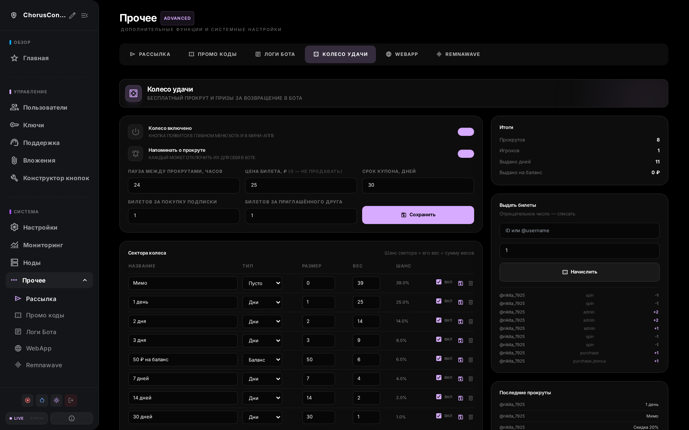 |
| Обращения | Колесо удачи |

<sub>Данные на скриншотах подменены: идентификаторы, имена и ссылки подписок — выдуманные.</sub>

</details>

### 📐 Вёрстка под реальные экраны

Мини-апп и панель проверены от 360 px до десктопа: без горизонтального скролла, без обрезанных заголовков, без разъезжающихся строк. На телефоне панель не ужимается до 85%, области нажатия не меньше 44 px, учтены вырезы экрана.

### 🛡 Мелочи, которые чинили по логам

- Шрифты раздаются со своего домена — внешний блокирующий `<link>` на `fonts.googleapis.com` не давал странице отрендериться там, откуда до Google не дозвониться.
- Вход через Telegram в браузере — универсальная ссылка `https://t.me/…` вместо схемы `tg://`, которую iOS во встроенных браузерах не открывает вовсе.
- Загрузка кабинета не может зависнуть навсегда: у опроса авторизации есть таймаут, у ошибок — текст и кнопка повтора.
- Пароли кабинета хранятся хешем с солью, а не открытым текстом.
- Правовые документы лежат в проекте и раздаются им же — ссылки больше не могут стать битыми.

### 🔐 Кабинет отвечает только своему владельцу

В оригинале мини-апп верил `user_id`, присланному клиентом: и страница `/?user_id=…`, и каждая ручка `/api/*`. Зная чужой Telegram ID, можно было открыть чужой кабинет, прочитать переписку с поддержкой и потратить чужой баланс, а `/api/auth/telegram-direct` по одному только ID выдавал постоянный токен входа.

Теперь личность вычисляет сервер по токену сессии — из заголовка или из куки, которую он же и ставит (`HttpOnly`, `Secure`, `SameSite=Lax`), а `user_id` из запроса не используется вовсе. Вход через Telegram требует подписанной `initData` со сверкой в постоянное время и проверкой возраста; вложения поддержки отдаются только участнику обращения; схема API и `/docs` наружу не публикуются.

---

## Установка

Скриптов-установщиков здесь нет: они предполагали чистый сервер и разворачивали Docker, Nginx и Certbot с нуля. Если бот у вас уже работает, всё это уже есть.

**К сожалению можно установить только с нуля** — пока обновится с оригинального бота не получится:

```bash
git clone https://github.com/KirillkaUsov/cybererror-s-remnawave-shopbot-extended.git /root/remnawave-shopbot
cd /root/remnawave-shopbot
docker compose up -d --build
```

Дальше панель на `:1488`, мини-апп на `:8000` — их принято закрывать своим Nginx с сертификатом. Мини-аппу нужен отдельный домен (или путь) с валидным HTTPS, иначе Telegram его не откроет.

Требования те же, что у оригинала: Ubuntu 20.04+ / Debian 11+, root по SSH, Remnawave на целевых хостах, 1 ГБ RAM.

---

## Обновление

```bash
cd /root/remnawave-shopbot && git pull && docker compose up -d --build
```

Правки шаблонов и HTML подхватываются без пересборки — каталог проекта смонтирован в контейнер. Пересборка нужна только для изменений в Python и зависимостях.

---

## Лицензия и происхождение

[GPLv3](LICENSE) — та же, что у оригинала.

Основан на [Remnawave ShopBot](https://github.com/CyberERROR/remnawave-shopbot) © [@CyberERROR](https://github.com/CyberERROR). Авторство базового кода принадлежит ему, изменения в форке — [@KirillkaUsov](https://github.com/KirillkaUsov).

Шрифты Golos Text и JetBrains Mono в `src/shop_bot/webapp/static/fonts/` — [SIL Open Font License 1.1](src/shop_bot/webapp/static/fonts/OFL.txt).
